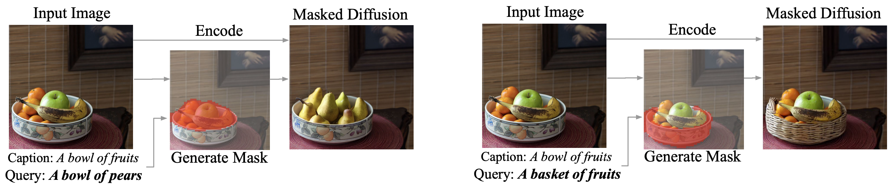
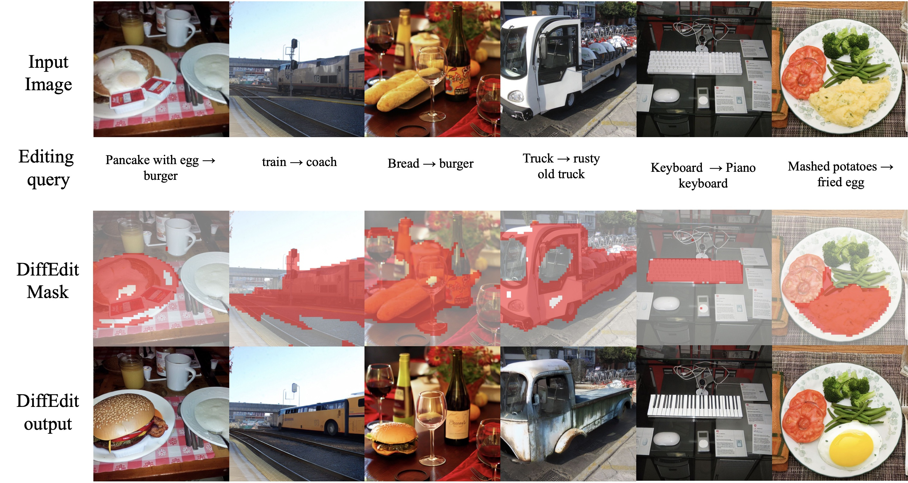
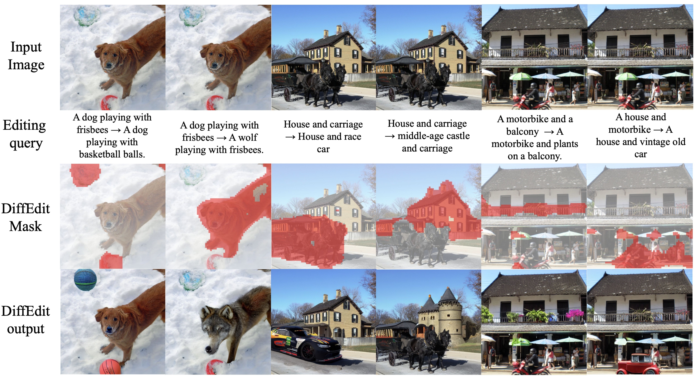
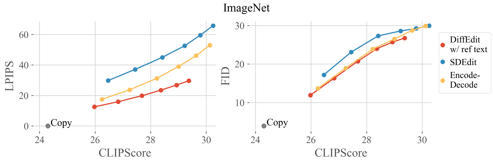
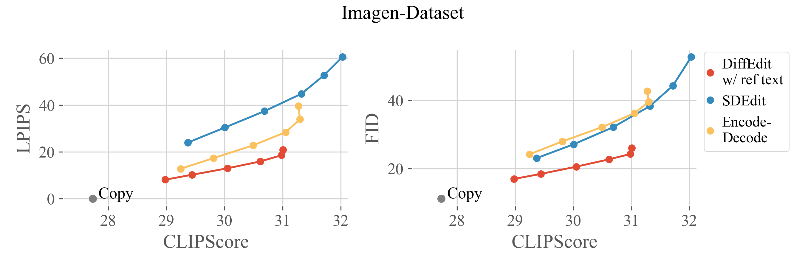
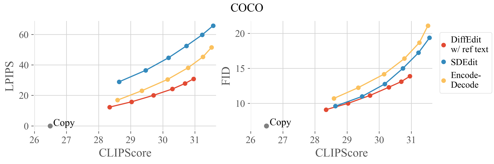

We propose DiffEdit by Guillaume Couairon, Jakob Verbeek, Holger Schwenk, Matthieu Cord (ICLR 2023 Spotlight)
[DiffEdit](https://arxiv.org/abs/2210.11427)

**Text-based Image Editing** consists in modifying an input image according to an editing query in natural language. The query can be either a single novel caption for the image, or a pair of sentences describing the requested transformation (e.g. *A bowl of fruits -> A basket of fruits*). The aim is to match the novel image description as much as possible, while editing the input image as little as possible.

## Diffusion Editing methods

* ### SDEdit

The *SDEdit* algorithm edits image by adding noise to the input image and denoising it conditionally to the editing query.

* ### Encode-Decode

The *Encode-Decode* algorithm first inverts the input image with reverse DDIM sampling, before denoising it contionnally to the editing query.

* ### DiffEdit

The *DiffEdit* algorithm, given a text transformation query, automatically finds a ROI mask covering the image region to be edited. Masked diffusion sampling is then performed, combined with latent inference based on reverse DDIM sampling.



Examples:





## Benchmark

We propose a benchmark for evaluating text-based image editing models, based on three datasets (ImageNet, COCO, Imagen-Dataset) and three evaluation metrics: LPIPS (distance to input image), FID (image realism) and CLIPScore (alignment with target prompt). Text-based image editing methods have to satisfy the two contradictory objectives of (i) matching the text query and (ii) staying close to the input image. For a given editing method, better matching the text query comes at the cost of increased distance to the input image. Different editing methods often have a parameter that allows to control the editing strength: varying its value allows to get different operating points, forming a trade-off curve between the two objectives aforementioned. Therefore, we evaluate editing methods by comparing their trade-off curves. For diffusion-based methods, we use the encoding ratio to control the trade-off. See the [paper](https://arxiv.org/abs/2210.11427)  for more details.






```
@article{couairon2022diffedit,
  title={DiffEdit: Diffusion-based semantic image editing with mask guidance},
  author={Couairon, Guillaume and Verbeek, Jakob and Schwenk, Holger and Cord, Matthieu},
  journal={International Conference in Learning Representations},
  year={2023}
}
```

## Bibliography
Here is a list of work that you will find useful:

- Prompt-to-Prompt Image Editing with Cross Attention Control [[paper]](https://arxiv.org/abs/2208.01626) [[code]](https://github.com/google/prompt-to-prompt)

- Null-text Inversion for Editing Real Images using Guided Diffusion Models [[paper]](https://arxiv.org/abs/2211.09794)

- UniTune: Text-Driven Image Editing by Fine Tuning an Image Generation Model on a Single Image [[paper]](https://arxiv.org/abs/2210.09477)

- Unifying Diffusion Models' Latent Space, with Applications to CycleDiffusion and Guidance [[paper]](https://arxiv.org/abs/2210.05559)

- InstructPix2Pix: Learning to Follow Image Editing Instructions [[paper]](https://arxiv.org/abs/2211.09800)